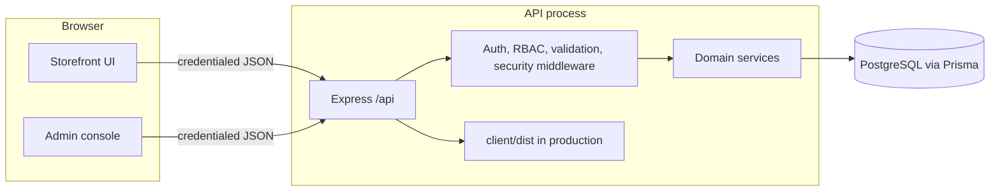
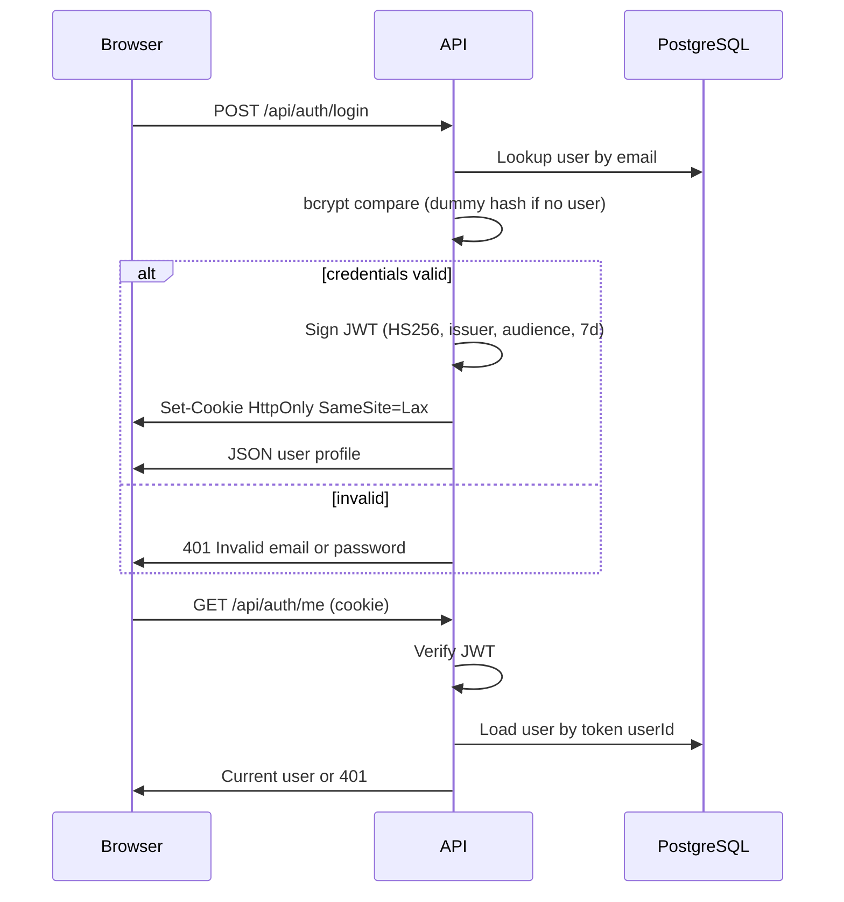
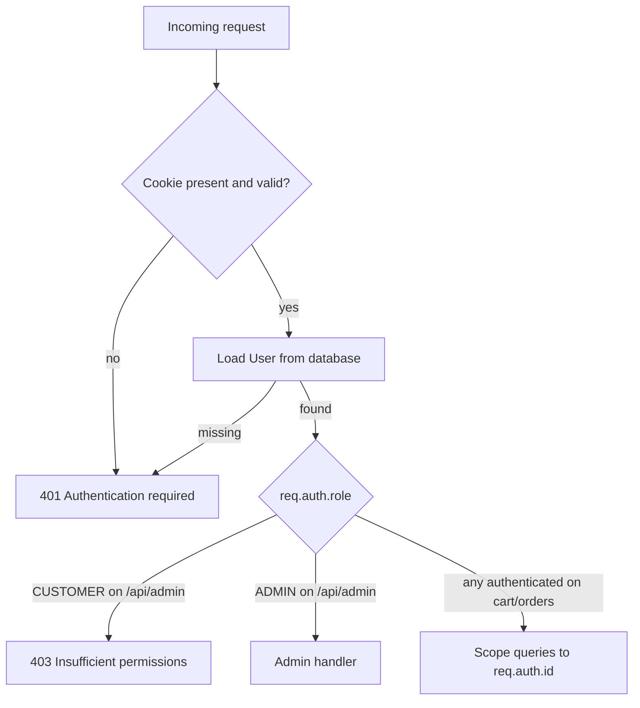
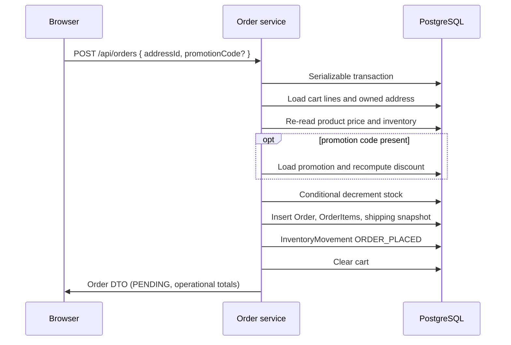
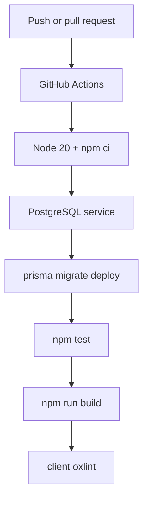

# Architecture

Vendora is a two-package npm workspace: a React SPA and an Express JSON API sharing one PostgreSQL database.

## High-level system

In local development, Vite serves the client and proxies `/api` to Express. In production, the same Express process serves the Vite build from `client/dist` and keeps `/api` on the same origin. See [DEPLOYMENT.md](DEPLOYMENT.md).

## Frontend responsibilities

The `client/` app:

- Renders the storefront and `/admin` console
- Calls `/api` with Axios (`withCredentials: true`)
- Keeps session state from `GET /api/auth/me` (cookie is HTTP-only; JavaScript never stores the JWT)
- Formats money as display strings; it does not compute checkout totals as a source of truth
- Uses Recharts on analytics; ranked lists remain visible without relying on colour alone

## Backend / API responsibilities

The `server/` app:

- Exposes REST routes under `/api`
- Validates bodies, query strings, and params with Zod (`.strict()` where used)
- Authenticates via the `commerceops_token` cookie
- Authorizes with the **database** user role
- Runs checkout and stock mutations in Prisma transactions
- Returns public DTOs (no `passwordHash`, no JWT in JSON)

## PostgreSQL / Prisma responsibilities

Prisma owns schema, migrations, and typed access. Money uses `Decimal(12, 2)`. Historical order rows snapshot catalogue and address data so later product edits do not rewrite completed orders.

See [DATABASE.md](DATABASE.md).

## Authentication flow

Logout clears the cookie with the same Path / HttpOnly / SameSite / Secure attributes used when it was set.

## Authorization / RBAC flow

The JWT may include a `role` claim for convenience. Middleware does **not** trust it for privileges. `requireRole` reads `req.auth.role` from Prisma.

Customers cannot pass `userId` / `customerId` to act as someone else. Address, cart, and customer order queries are scoped to the session user.

## Checkout transaction flow

Client-supplied `total`, `subtotal`, `discountAmount`, `status`, and similar fields are rejected by the create-order schema. Shipping in this demonstration is `0.00`. Status is `PENDING`. No payment is captured.

## Inventory movement flow

Current quantity lives on `Inventory`. `InventoryMovement` is append-only.

| Type | Typical source |
| --- | --- |
| `INITIAL_STOCK` | Product created with opening quantity |
| `RECEIPT` | Admin receive |
| `ADJUSTMENT` | Admin manual adjust (or legacy absolute inventory patch) |
| `ORDER_PLACED` | Checkout decrement |
| `ORDER_CANCELLED` | Admin cancel restock (once, product-linked lines) |

Admin receive/adjust cannot take stock below zero. Checkout decrements only if the whole transaction succeeds.

## Promotion flow

1. Admin creates a code (percentage or fixed amount, window, optional minimum merchandise subtotal).
2. Customer may preview with `POST /api/promotions/validate` against the **current** cart.
3. Checkout revalidates the same rules inside the order transaction.
4. The order stores `promotionCode` and `discountAmount` as snapshots. Later promotion edits do not change historical orders.

Codes are normalised (trim, uppercase). One code per order. No stacking.

## Analytics flow

`GET /api/admin/analytics?range=7d|30d|90d|all` (default `30d`) aggregates existing order, user, and inventory rows. Rolling ranges use UTC calendar days. Cancelled orders count toward activity and status, not toward non-cancelled order value, units, top products, or promotion usage. Inventory figures are a **current** snapshot, not ranged. Results are aggregates; customer identities are not listed.

## CI flow

CI uses a throwaway database and a placeholder JWT. It does not use production secrets.

## Security boundaries

- Browser never receives the JWT in JSON and cannot read the HTTP-only cookie
- CORS allows a single `CLIENT_ORIGIN` with credentials (not `*`)
- Helmet sets standard security headers; CSP is off so the Vite production bundle can load
- JSON bodies limited to 100kb; malformed JSON is `400`; oversized is `413`
- Login/register rate limits (in-memory, per process)
- Unsafe methods with an explicit foreign `Origin` are `403` (defence-in-depth with SameSite cookies; not a complete CSRF product)
- `trust proxy` is unset in development and tests. In production it is the positive integer `TRUST_PROXY_HOPS` (never `true`). Verify the hop count against the actual host request path; do not assume a fixed proxy topology.
