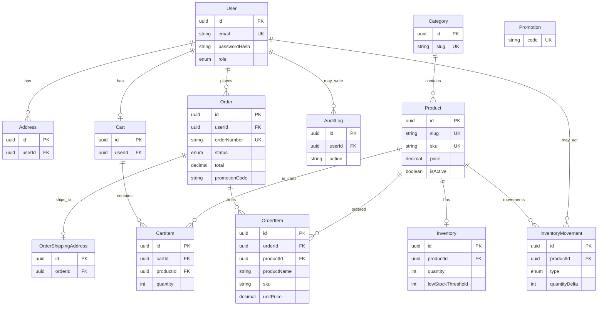

# Database

PostgreSQL is the system of record. Prisma defines the schema and migrations in `server/prisma/`. This document matches the current `schema.prisma` only.

Money fields use `Decimal(12, 2)`. Users are identified by UUID. There is no Prisma relation from `Order.promotionCode` to `Promotion`; the code on an order is a historical snapshot string.

## Entity relationship diagram

`Promotion` is standalone. Checkout copies a usable code onto `Order.promotionCode`.

## Models

### User

Account identity: email (unique), bcrypt `passwordHash`, name, and `Role` (`CUSTOMER` or `ADMIN`, default `CUSTOMER`). Public registration always inserts `CUSTOMER`. Owns addresses, optional cart, orders, optional audit rows, and optional inventory movement actor links.

### Address

Saved shipping profile for a user. Checkout copies fields onto `OrderShippingAddress`; deleting an address does not rewrite past orders.

### Category

Catalogue grouping: unique `name` and `slug`, optional description. Products cannot delete a category while they still reference it (`onDelete: Restrict`).

### Product

Sellable item: unique `slug` and `sku`, `price`, `isActive` (archive sets this false), description, and `categoryId`. Public catalogue returns active products only.

### Inventory

One row per product (`productId` unique): current `quantity` and `lowStockThreshold`. Quantity is the live stock figure used at add-to-cart and checkout.

### InventoryMovement

Append-only ledger. Types: `INITIAL_STOCK`, `RECEIPT`, `ADJUSTMENT`, `ORDER_PLACED`, `ORDER_CANCELLED`. Stores `quantityDelta`, `quantityBefore`, `quantityAfter`, optional note, optional `referenceType` / `referenceId`, optional `actorUserId`. Product delete cascades movements.

### Cart

One cart per user. Created empty when needed. Checkout clears lines after a successful order.

### CartItem

Line in a cart: unique `(cartId, productId)`, integer `quantity`. Product delete is restricted while a line exists.

### Order

Customer order: unique `orderNumber`, `OrderStatus` (default `PENDING`), `subtotal`, `discountAmount`, `shippingAmount`, `total`, optional `promotionCode`. Totals are operational order value, not payment receipts. User delete is restricted while orders exist.

### OrderItem

Line on an order. Snapshots: `productName`, `sku`, `unitPrice`, `quantity`, `lineTotal`. `productId` is optional and set null if the product is later deleted, so the snapshot remains.

### OrderShippingAddress

One shipping snapshot per order (address fields copied at checkout). Cascades with the order.

### Promotion

Discount definition: unique `code`, `DiscountType` (`PERCENTAGE` or `FIXED_AMOUNT`), `discountValue`, optional `minimumOrderValue`, `startsAt` / `endsAt`, `isActive`. Not linked by foreign key to orders.

### AuditLog

Admin mutation trail: `action`, `entityType`, optional `entityId`, JSON `metadata`, optional `userId` (set null if the user is deleted).
