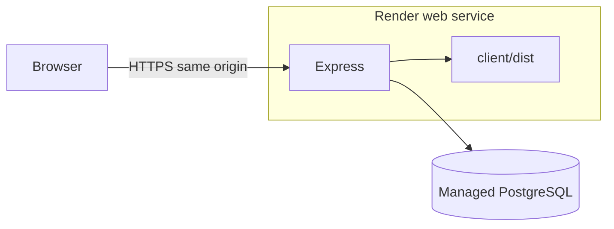

# Deployment

Vendora is live at **https://commerce-operations-platform.onrender.com**.

The production environment is deployed as a single Render web service backed by Neon PostgreSQL. The hosted storefront, API, database connectivity, customer checkout/order persistence, and admin order access have been verified.

## Architecture

Production is one Node.js process:

- Express serves the JSON API under `/api`
- The same process serves the Vite production build from `client/dist`
- React Router paths fall back to `index.html`
- Requests under `/api` never fall through to the SPA
- PostgreSQL is hosted by Neon
- The web service runs on Render

Local development is unchanged: Vite serves the client on port 5173 and proxies `/api` to Express on port 3001.



Do not run a second web server in production. Do not put the Vite preview server on the public internet.

## Render web service

Current production shape:

- Public URL: `https://commerce-operations-platform.onrender.com`
- Runtime: Node.js 20
- Branch: `main`
- Root of the repository as the service root
- Build command equivalent to: install dependencies (including build tools), build client and server, apply production Prisma migrations
- Start command: compiled Express (`npm start`, which runs `node server/dist/index.js` via the server workspace)
- Health check: `GET /api/health`

`render.yaml` in the repository root describes this blueprint. It contains **no secrets**. `DATABASE_URL`, `JWT_SECRET`, and `CLIENT_ORIGIN` are marked `sync: false` so they must be set in the Render dashboard.

Render provides `PORT`. Do not hard-code a production port. The process binds `0.0.0.0` in production so the host can reach it.

`--include=dev` is required during install so TypeScript, Vite, and the Prisma CLI are present for the build. `NODE_ENV=production` is still set for the running process so Secure cookies are enabled.

The database seed is **not** part of build or start. `npm run db:seed` was run explicitly once to initialize the production demo catalogue; it should not be wired into automatic deploys.

## Managed PostgreSQL (Neon)

Prisma is configured for standard PostgreSQL:

```
datasource db {
  provider = "postgresql"
  url      = env("DATABASE_URL")
}
```

A normal `DATABASE_URL` is enough. There is no Neon-specific client library.

Use the connection string from the provider dashboard. Typical TLS query parameter: `sslmode=require`.

Neon often shows two hosts:

- **Direct** (no `-pooler` in the host): use this for `prisma migrate deploy`
- **Pooled** (host contains `-pooler`): optional for the running app under many concurrent connections

The current deployment uses a standard direct PostgreSQL connection. If URLs are split later, keep migrations on the direct host.

Do not commit a real Neon URL.

## Required environment variables

Set these in the Render dashboard (and in Neon, the database URL). Never commit real values.

| Name | Production |
| --- | --- |
| `NODE_ENV` | `production` |
| `PORT` | Provided by the host; do not set a local-dev port |
| `DATABASE_URL` | Managed PostgreSQL URL |
| `JWT_SECRET` | Random secret, **at least 32 characters** |
| `CLIENT_ORIGIN` | Public app origin, no trailing slash; current value is the Render service origin |
| `TRUST_PROXY_HOPS` | Positive integer. Current deployment starts from `1`; never use `true`. |

`CLIENT_ORIGIN` must match the public HTTPS origin of the Render service. In production the browser talks to the API on the **same origin**. CORS still allows only this origin (not `*`). The trusted-origin check for unsafe methods also uses this value.

`VITE_API_URL=/api` stays a relative path so the built client calls the same origin. Do not bake a localhost API URL into the production client build.

## Build process

From the repository root:

```bash
npm ci --include=dev
npm run build
```

`npm run build` runs the Vite production build (`client/dist`) and compiles the server (`server/dist`), including `prisma generate`.

## Production migrations

Use **only**:

```bash
npm run prisma:migrate:deploy
```

That runs the server workspace `prisma migrate deploy` from the repository root. It applies existing migrations. It does **not** run `prisma migrate dev` and does not create new migrations.

Do not modify or add migrations unless the schema actually changes.

`render.yaml` runs `npm run prisma:migrate:deploy` at the end of the build, so `DATABASE_URL` must be available at build time on Render.

## Start process

```bash
npm start
```

This starts `node dist/index.js` in the server workspace. In production the process:

- Listens on `PORT` on `0.0.0.0`
- Sets Express `trust proxy` to `TRUST_PROXY_HOPS` (a positive integer; never `true`)
- Serves `client/dist` for non-API GET/HEAD requests
- Sets the auth cookie `Secure` flag because `NODE_ENV=production`

Do not start Vite in production.

## Health checks

| Path | Purpose |
| --- | --- |
| `GET /api/health` | Process is up. JSON `{ status, service }`. Used as the Render health check. |
| `GET /api/health/database` | Runs `SELECT 1`. JSON `{ status, database }`. `503` if PostgreSQL is unreachable. |

Both stay under `/api`, so the SPA fallback cannot intercept them. Responses do not include connection strings, secrets, or internal errors.

An unknown `/api/...` path returns JSON `404`, not `index.html`.

## Production verification

The current hosted environment has been manually verified for:

- Public homepage and `/shop` rendering from the production React build
- `GET /api/health` returning JSON `200`
- `GET /api/health/database` returning JSON `200` with `database: connected`
- Unknown `/api/...` requests returning JSON `404` instead of the SPA
- Production Prisma migrations applying successfully during the Render build
- Explicit one-time catalogue seed with six demo products
- Customer registration, login, logout, cart, checkout, and `PENDING` order creation over HTTPS
- Customer order persistence after logout and login
- Admin authorization and `/admin/orders` access to the production order

No real payment is processed; checkout remains a portfolio/demo flow.

## HTTPS and proxy behaviour

Render terminates HTTPS and forwards HTTP to the Node process with `X-Forwarded-*` headers. Traffic may pass through more than one edge or proxy hop; do not treat a hop count of `1` as a universal fact about Render.

In production only, Express sets `trust proxy` to `TRUST_PROXY_HOPS`, a positive integer. That lets:

- `req.secure` / `Secure` cookies work behind TLS termination
- `express-rate-limit` identify clients from `X-Forwarded-For` using the configured hop count

Development and tests do not trust a proxy. The app never sets `trust proxy` to `true` (arbitrary hops).

If cookies or rate-limit identity behave incorrectly after infrastructure changes, confirm the actual proxy path and adjust `TRUST_PROXY_HOPS` without changing application code. Do not expose client IPs through a public debug endpoint.

## Secure cookies

Auth uses cookie `commerceops_token`:

- HttpOnly
- SameSite=Lax
- Path `/`
- `Secure` when `NODE_ENV=production`

Same-origin production (HTTPS app serving both UI and API) is compatible with SameSite=Lax. `CLIENT_ORIGIN` must be the public `https://` origin so CORS and trusted-origin checks match the browser.

## Deployment checklist

The current production environment has completed these deployment steps:

1. Neon PostgreSQL project created for production.
2. Render web service created from `main` using the repository root.
3. Production environment variables configured in Render without committing secrets.
4. Host-provided `PORT` used by the service.
5. Client/server build and `prisma migrate deploy` completed successfully.
6. `GET /api/health` verified with JSON `200`.
7. `GET /api/health/database` verified with `database: connected`.
8. `GET /` verified as the React application.
9. `/shop` verified as a client-side route with seeded catalogue data.
10. Unknown `/api/...` route verified as JSON `404`, not HTML.
11. Customer authentication/session and order persistence verified over HTTPS.
12. Demo catalogue seeded explicitly once; seeding is not automatic.
13. Admin order access verified in the hosted environment.

For a fresh deployment, repeat the same sequence and keep all credentials in provider environment settings rather than source control.

## Rollback and troubleshooting

- **Failed migrate:** The build stops before start. Fix the database URL (prefer the Neon **direct** host for migrate) or restore a previous release; do not run `prisma migrate dev` against production.
- **Health check failing:** Check `GET /api/health`. If that works but the site is HTML 404s, the client build may be missing (`client/dist` not produced).
- **Database health 503:** `DATABASE_URL`, Neon network availability, or TLS parameters may be wrong. The health payload will not include the URL.
- **Cookies not set / login loops:** `NODE_ENV` must be `production`, `CLIENT_ORIGIN` must be the exact public origin (`https://...`, no trailing slash), and `TRUST_PROXY_HOPS` must match the actual proxy path (never `true`).
- **CORS or 403 Forbidden on POST:** `CLIENT_ORIGIN` does not match the browser origin. Do not set CORS to `*`.
- **Rate-limit / wrong client IP:** Confirm `TRUST_PROXY_HOPS` against the hosting request path. Do not set `trust proxy` to `true`, and do not add a public IP debug route.
- **Rollback:** Redeploy the previous Render release. Prisma migrations already applied stay applied; restoring schema requires a forward fix or a restored database. This app does not auto-seed, so a rollback does not re-insert sample data.

## Manual seed (optional)

```bash
npm run db:seed
```

Use this only when you intentionally want sample categories and products in an empty demo database. The current production environment was seeded once during initial deployment. It is not a deploy step and must not be wired into `render.yaml` start or build.
